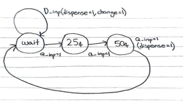
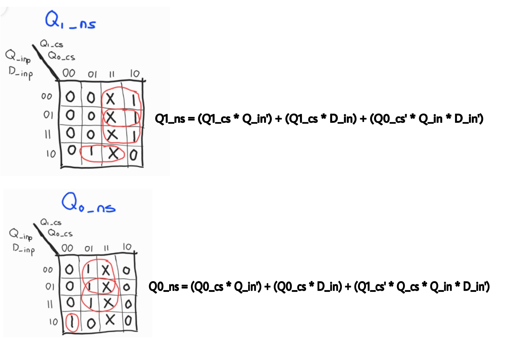
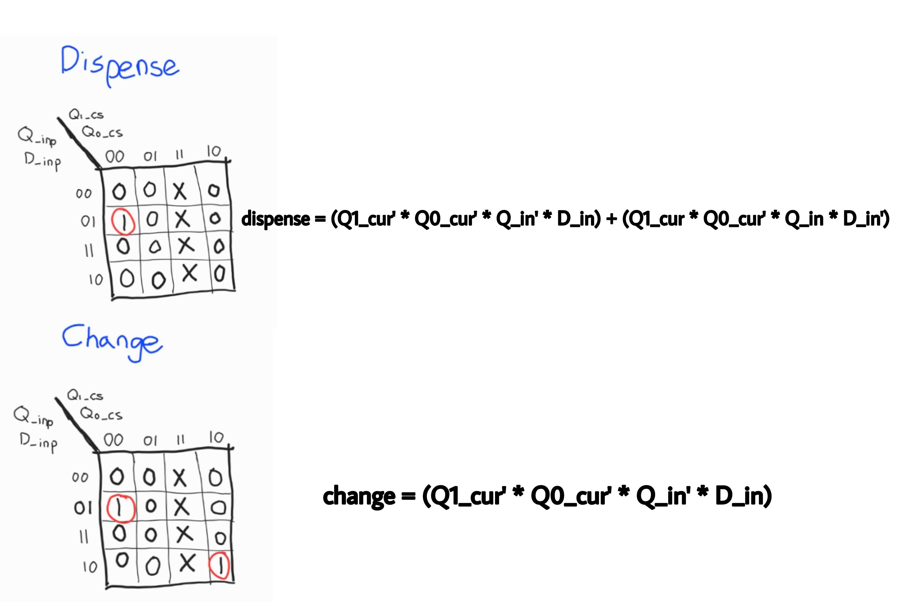

# WaterBottle Vending Machine FSM in C

## Incomplete ( no C implementation yet due to errrors :( )
##### Note: Subject to change.

## Introduction
This is a simple vending machine controller modelled by FSM in C. 

> The vending machine sells the bottle of water for 75¢ each. The customer can only enter one dollar and quarter. The money receiver will indicate whether a dollar or quarter is received. The money receiver will reject the money if the customer enters money other than one dollar or quarters. When the customer pays with quarters, the machine needs to keep track of how many quarters have been received. If a sufficient(exact) amount of money is entered, the vending machine will dispense one bottle. In another case, if a dollar is entered instead, the machine will dispense a bottle of water and dispense 25¢ as change. The machine will go back to its initial state (Wait) and the vending machine will be ready to be used again.

## FSM

### This is the State Diagram

### This is the State Transition Table

### This is the K-Map

##Simulation of the system in C
