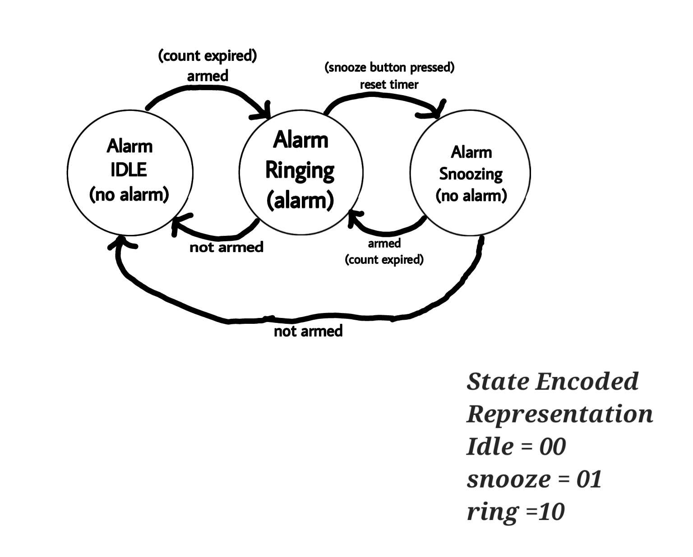
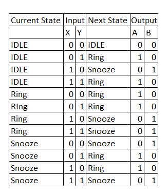
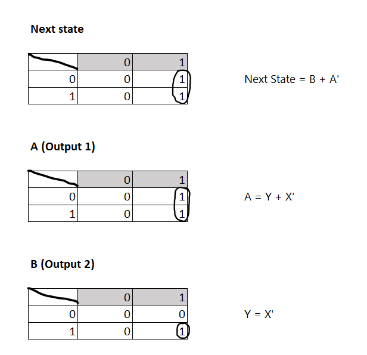
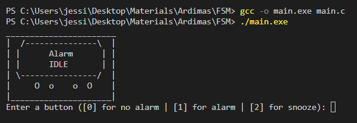
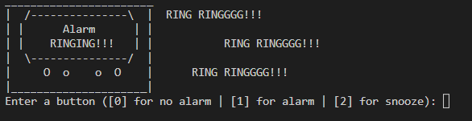
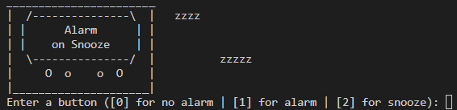

# Alarm Clock FSM in C

## Introduction
This is a simple Alarm Clock modelled by FSM in C.

> The alarm clock has three states: Idle, Ring and snooze. The alarm clock transitions between the three states based on the input it receives. For example, if the alarm clock is in idle, and receives the input "alarm", it will transition to "ring" state.

## FSM

>In this FSM, The Alarm clock starts in the "IDLE" state, where there is no alarm/ the alarm is off. Then, it can transition to "Alarm" state where the alarm is on, which will be ringing. It can transition back to "IDLE" state or "snooze" state which will make the alarm snooze and will go back to "alarm" state after a period of time.

## State Transition Table



## K-map with combinatorial boolean equations


## How to run
> Type in the terminal
```c
gcc -o main.exe main.c
```
> and then enter and type in the terminal
```c
./main.exe
```

## Testing

> This is the alarm clock at "IDLE" state.



 > This is the alarm clock at "ring" state.
 


> This is the alarm clock at "snooze" state.



